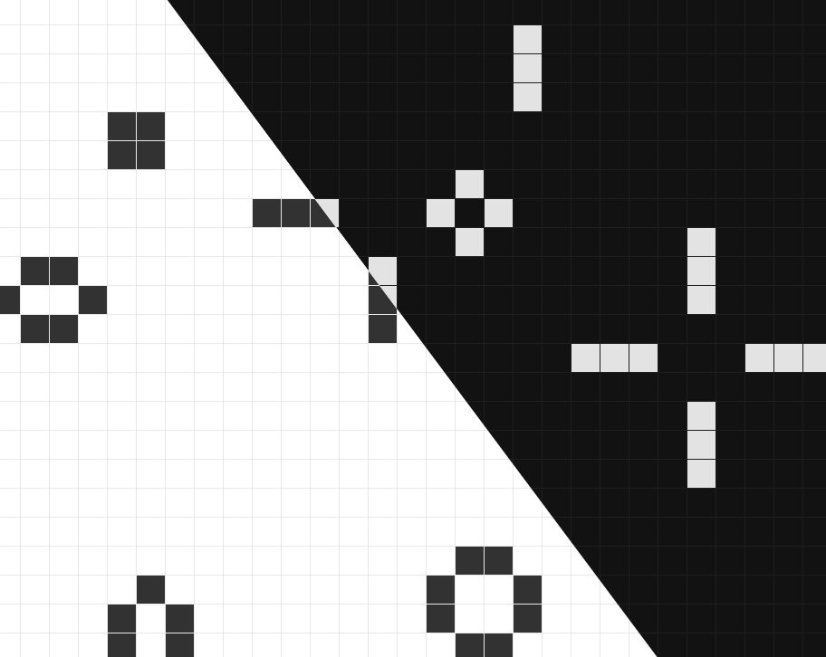

# Conway's Game of life
Conway's game of life built using Rust, WASM & React.

**🔗 [View Deployment on GitHub Pages](https://arpitjp.github.io/wasm-game-of-life/)**

- Fixed size periodic universe that wraps around
- Dark Mode 🌙
- Click on cells in grid to toggle their state
- Grid size is responsive, based on viewport
- Metrics like frame rate, generation, grid dimensions

## Local Setup
- Install `node`, `npm`, `rust`, `wasm-pack`
- Compile rust crate to wasm - `npm run wasm`
- Install npm packages - `npm run i`
- Run local dev server - `npm run dev`

To deploy to GitHub pages, run `chmod 777 ./deploy.sh && ./deploy.sh`
## Stack
- UI - React, Vite
- Game renderer - Rust compiled to WASM

## Reference / Credits
https://rustwasm.github.io/docs/book/game-of-life
